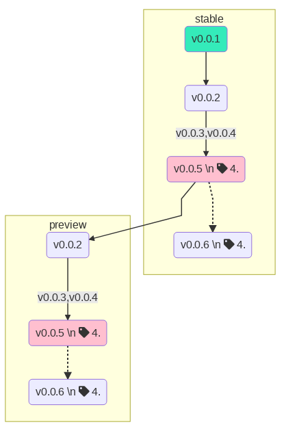

### All things tofel.tech

## Java

## Kubernetes (k8s)

## Docker Image as a Command

Mermaid has a docker image that is meant to run the app with no install, so I wrapped it with this zsh function:
```bash
mermaid_maker() {
  MERMAID_CODE_FILE=$1 && docker pull minlag/mermaid-cli && docker run -v $PWD/$MERMAID_CODE_FILE:/$MERMAID_CODE_FILE -v /tmp:/tmp -it docker.io/minlag/mermaid-cli:latest -i /$MERMAID_CODE_FILE -o /tmp/$MERMAID_CODE_FILE.png && echo "output PNG file is /tmp/$MERMAID_CODE_FILE.png" && open /tmp/$MERMAID_CODE_FILE.png
}
```
when I save this code to a file (say, `mermaid_test`):
```
graph TD
   classDef head fill:#ffbfcf;
   classDef installed fill:#34ebba;
   subgraph stable
   A(v0.0.1):::installed --> B(v0.0.2)
   B(v0.0.2) x--x |v0.0.3,v0.0.4| C(v0.0.5 \n fa:fa-tag 4.6):::head
   C -.-> E(v0.0.6 \n fa:fa-tag 4.6)
   end
   subgraph preview
   C --> BB(v0.0.2)
   BB(v0.0.2) x--x |v0.0.3,v0.0.4| CB(v0.0.5 \n fa:fa-tag 4.6):::head
   CB -.-> EB(v0.0.6 \n fa:fa-tag 4.6)
   end
```
[code for graph credit to: Camila Macedo at redhat.com]

run as: `mermaid_maker mermaid_test` and have it render the graph!



If docker pull already <5 sec to render, if docker pull needed, like 25 second on first usage.


## Python for Machine Learning

## IDEs
- My favorite IDEs and what I use them for:

| IDE      	| Language 	| Notes                                                 	|
|----------	|----------	|-------------------------------------------------------	|
| PyCharm  	| Python   	| install numpy, scipy & allow added interface features 	|
| IntelliJ 	| Java     	|                                                       	|
| IntelliJ 	| Go       	| Install the plugin for Go, better than GoLand         	|
| IntelliJ 	| yaml     	| syntax highlighting & error checking                  	|
| DataGrip 	| SQL      	| also built-in to PyCharm, IntelliJ                    	|

# Best tips for using IntelliJ with Java
- For Maven based projects, find the `pom.xml` and open it under `New` `Project from Existing Source...`
# Best tips for using IntelliJ
- Use the VCS->git tools for many common git operations, but mix in cli commands where they are better/easier, the built-in git will figure out what's going on. For instance, `git pull --rebase master <branch>` is very handy from the cli. When you are confronted with merge conflicts, jump back to IntelliJ and look in the git pane, you will be offered chance to resolve conflicts graphically. When done, `git rebase --continue` on the cli.
